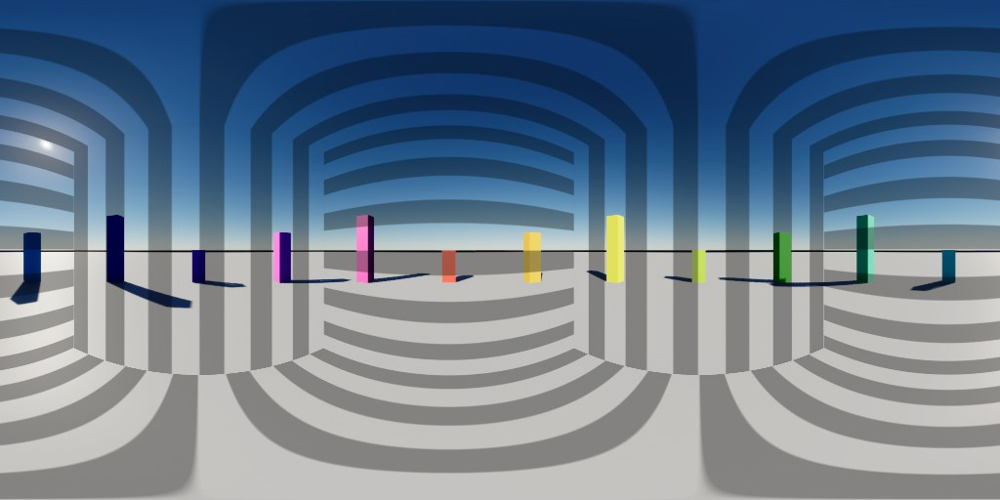
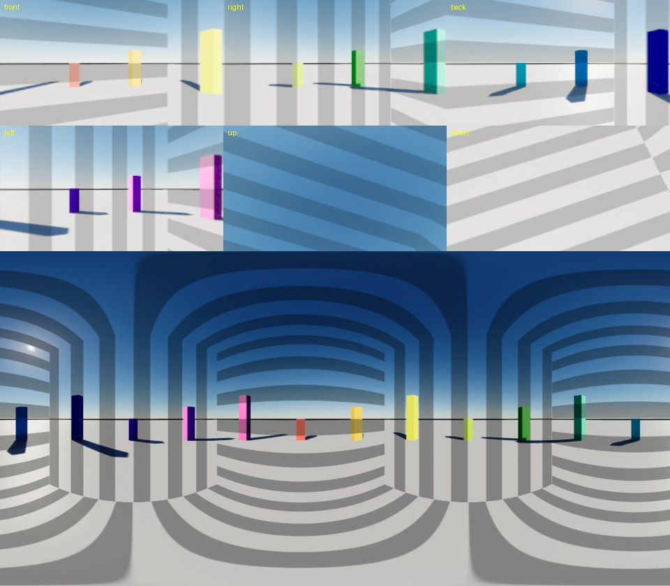
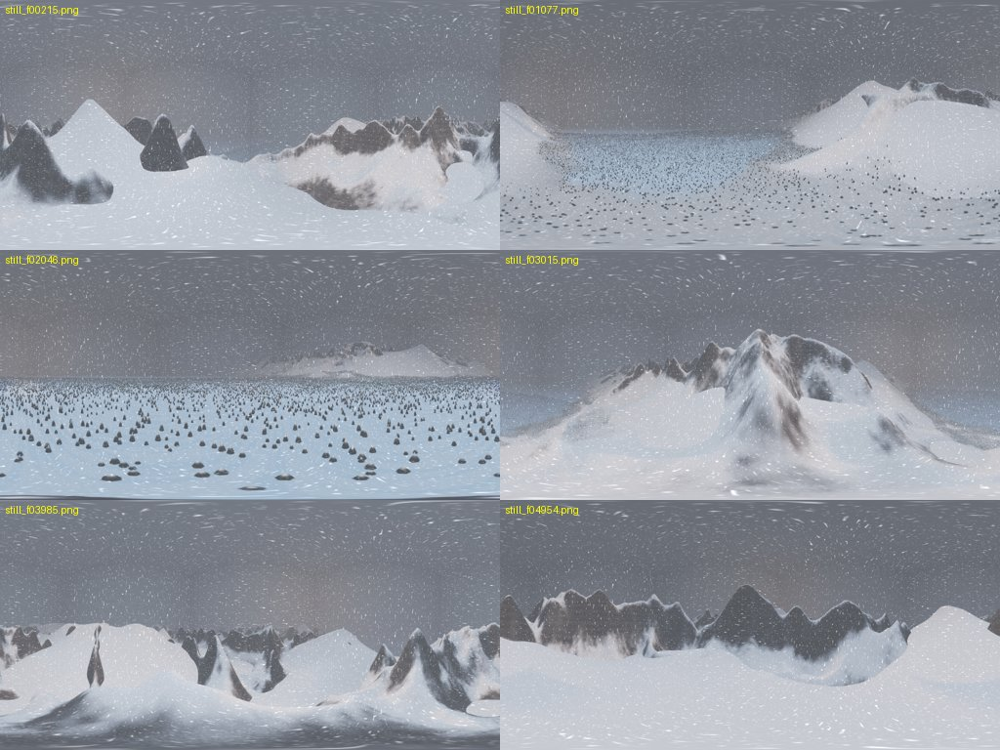

# unreal-360-render

A Claude Code skill (and a plain Python CLI) that adds a **360° camera** to an Unreal Engine 5 level and renders **equirectangular stills and video** from it — scripted, offscreen, no plugins — then encodes an MP4 tagged as 360 video and previews it in a local WebGL viewer.



*The bundled demo level, rendered by the pipeline (1024×512). The curved bands are a screen-space post-process repeated on each of the six cube faces — a known limit, see below.*

## What it does

- **Rig**: a `SceneCaptureCube` ("Camera360") that flies the same path as an existing Level Sequence camera (location + yaw, level horizon), or sits at a fixed spot/actor.
- **Render**: an offscreen editor scrubs the sequence frame by frame, captures the cube, converts it to lat/long with an unlit material and exports Radiance `.hdr` per frame.
- **Self-check**: six coloured calibration spheres prove the axis mapping; black-frame and compile-failure detection; a stall guard relaunches a hung editor.
- **Time fix**: `patch-time` gives Time-driven materials (blizzard flakes, scrolling noise, water…) a steady render clock so they don't jump between scrubbed frames; `--fixed-step` does it globally for anything on world time.
- **Output**: PNG stills, a contact sheet, six perspective cut-outs for checking orientation, an H.264/H.265/VP9 file with spherical metadata (YouTube / VLC / headsets), and a dependency-free WebGL viewer.
- **ffmpeg handling**: finds a build with the needed encoder (PATH, `imageio-ffmpeg` in pip/uv caches, winget/scoop/choco…), explains when none exists.



## Install

As a Claude Code skill (personal):

```bash
git clone https://github.com/oisinryan/unreal-360-render-skill ~/.claude/skills/unreal-360-render
```
or run `./install.ps1` / `./install.sh` from a checkout to copy it there. Claude then loads `SKILL.md` whenever you ask for a 360 / panoramic / VR render from Unreal.

Requirements: Windows (tested), Unreal Engine 5.x installed via the Epic launcher (tested on 5.8), a project with **PythonScriptPlugin** and **EditorScriptingUtilities** enabled, Python 3.9+ with `numpy` and `pillow`, and an ffmpeg with an H.264 encoder (`pip install imageio-ffmpeg` is enough). `python scripts/ue360.py doctor --project X.uproject` checks all of it.

## Quick start

```bash
python scripts/ue360.py doctor    --project D:/Proj/Proj.uproject
python scripts/ue360.py testscene --project D:/Proj/Proj.uproject      # optional: builds /Game/UE360Demo to try everything on
python scripts/ue360.py setup     --map /Game/Maps/Canyon --source-sequence /Game/Seq/LS_Flight --source-binding FlightCamera
python scripts/ue360.py calib     --frame 900
python scripts/ue360.py stills    --frames 100,900,1800
python scripts/ue360.py clip      --start 600 --count 180 --step 2
python scripts/ue360.py video     canyon_demo
python scripts/ue360.py view
```
(`--project` is remembered via `<project>/Saved/UE360/session.json`; run `ue360.py -h` or see [SKILL.md](SKILL.md) for every option.) Output goes to `<project>/Saved/UE360/out`.

## Time-driven effects

```
ue360.py patch-time --material /Game/FX/M_Blizzard       # once; backs the .uasset up, UseOverride=0 outside renders
ue360.py clip ...                                         # renders set Time = sequence frame / fps
ue360.py clip ... --fixed-step --clock off                # alternative: fixed-delta editor ticks (experimental)
```
Measured on the demo's moving-stripe post-process (frame-to-frame shift of the stripe pattern, 39 steps): **−1 px on every step (spread 0.0)** with the render clock or with `--fixed-step`, versus **−1/−2 px mixed (spread 0.4)** without. Details in [references/time-control.md](references/time-control.md).

## What was tested

| Check | Result |
|---|---|
| Fresh minimal UE 5.8 project: `testscene` → `patch-time` → `setup` → `calib` → `stills` → `clip` → `video` → `view` | all pass; identity axis mapping, 4.34 / 5 calibration score |
| Rig with yaw 30°, pitch 25°, roll 15° (fixed location) | calibrates 4.65 / 5 |
| Render clock vs none vs `--fixed-step` | steady / steady / jittery (table above) |
| Skill folder and project paths containing spaces | work (scripts are copied to a space-free temp folder when needed) |
| Git Bash path mangling (`/Game/…`, `/c/…`) | repaired by the CLI |
| 180-frame 12 s clip of a large procedural snowstorm level (Nanite terrain, 80k trees, fog, post-process blizzard) | 1024×512 H.264, ~9 MB, ffmpeg reports `spherical: equirectangular`, plays in the viewer |
| `MP_MAX` / `ComponentMask` / sampler-type / world-aligned-cube / hung-start failures | each hit, fixed and documented in [references/gotchas.md](references/gotchas.md) |



*Six stills from the snowstorm level (the reference production run; the level itself is not part of this repo).*

**Not tested**: macOS/Linux, UE versions other than 5.8, cube faces above 512 px, Niagara under `--fixed-step`, World Partition levels, nDisplay/in-game (PIE) capture, stereoscopic output.

## Limits you should know

- **Screen-space effects are computed per cube face** (custom post-process materials, vignette, lens flare, DoF, motion blur): they repeat on all six faces and seam. Use world-space effects or accept it for demos.
- Mono only. Cube faces default to 512 px (right for ~1024-wide output).
- One heavy Unreal process at a time on a 16 GB machine.
- An open editor locks the files it has loaded; setup then fails with a sharing violation.
- `video` writes non-faststart MP4 on purpose (the spherical tag needs `moov` after `mdat`).

## Layout

```
SKILL.md                      the skill: when to use it, workflow, verification, pitfalls
scripts/ue360.py              CLI (engine discovery, headless + offscreen runs, stall guard, png/video/viewer)
scripts/ue360_setup.py        in-editor: render target, equirect + marker materials, rig, sequence
scripts/ue360_patch_time.py   in-editor: Time -> render-clock rewiring
scripts/ue360_capture.py      in-editor (rendering): calib / stills / clip
scripts/ue360_testscene.py    in-editor: demo level used for testing
viewer/viewer.html            dependency-free WebGL 360 player
references/                   how it works · gotchas · time control · video & viewing
evals/evals.json              example prompts that should trigger the skill
assets/                       images used in this README
```

## License
MIT — see [LICENSE](LICENSE).
